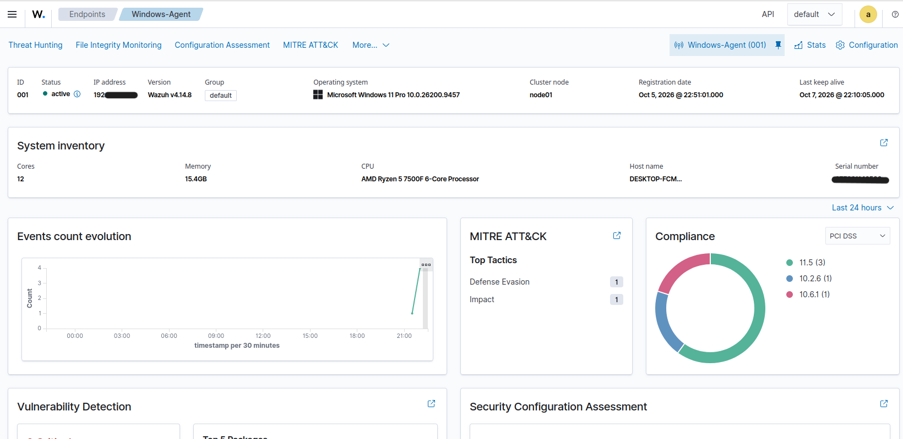
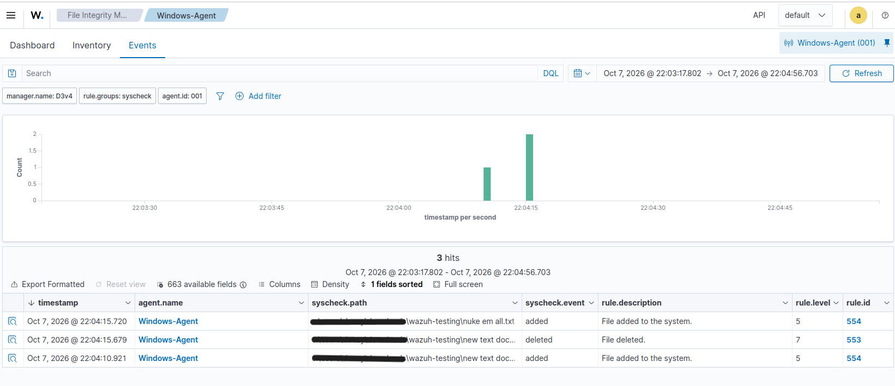

# Wazuh SIEM & Endpoint Monitoring Homelab

## Overview

This project documents the deployment and configuration of a Wazuh SIEM environment for hands-on learning in security monitoring and endpoint visibility.

The lab consists of a Wazuh Manager deployed on Ubuntu Server and a Windows endpoint configured with the Wazuh Agent. File Integrity Monitoring (FIM) was configured to detect changes to files and generate security alerts.

## Lab Architecture

```text
Ubuntu Server
Wazuh Manager
      │
      │
      ▼
Windows Endpoint
Wazuh Agent
      │
      ▼
File Integrity Monitoring
      │
      ▼
Wazuh Dashboard
```

## Technologies Used

* Wazuh
* Ubuntu Server
* Windows
* VirtualBox
* Linux Command Line

## What I Implemented

### 1. Wazuh Manager Deployment

Installed and configured the Wazuh Manager on an Ubuntu Server virtual machine.

### 2. Windows Agent Onboarding

Installed the Wazuh Agent on a Windows endpoint and registered it with the Wazuh Manager.

### 3. File Integrity Monitoring

Configured Wazuh File Integrity Monitoring (FIM) to monitor a selected Windows directory for file system changes.

The lab was configured to detect:

* File creation
* File modification
* File deletion

### 4. Alert Validation

Performed file operations within the monitored directory and verified that corresponding security alerts were generated and displayed in the Wazuh Dashboard.

## Results

Successfully established communication between the Wazuh Manager and Windows endpoint and generated FIM alerts from monitored file system activity.

This project provided hands-on experience with:

* SIEM deployment
* Endpoint monitoring
* Security event monitoring
* File Integrity Monitoring
* Alert analysis
* Linux administration

## Screenshots

### Active Windows Agent



### File Integrity Monitoring Alerts



## Future Improvements

Planned improvements to this lab include:

* Sysmon integration
* Custom detection rules
* MITRE ATT&CK mapping
* Additional security monitoring use cases
* Multi-endpoint monitoring
